<picture><source media="(prefers-color-scheme: dark)" srcset="assets/hero-dark.svg"></picture>

<a href="https://www.linkedin.com/in/nikhil-pawar"><picture><source media="(prefers-color-scheme: dark)" srcset="assets/btn-linkedin-dark.svg"></picture></a>&nbsp;&nbsp;<a href="mailto:nikhil.k.pawar.06@gmail.com"><picture><source media="(prefers-color-scheme: dark)" srcset="assets/btn-email-dark.svg"></picture></a>

I build and run cloud infrastructure. For three and a half years I was a DevOps engineer at **HP Inc**, running the AWS account behind HP's commercial device-telemetry platform. Now I'm doing an **MS in Computer Science at Northeastern University** in Seattle and building the projects below.

**Looking for a co-op or internship from January to August 2027** in DevOps, cloud infrastructure, SRE, AI/ML or data engineering.

## Projects

<a href="https://github.com/aimsotrash/homelab-infra"><picture><source media="(prefers-color-scheme: dark)" srcset="assets/card-homelab-infra-dark.svg"></picture></a><a href="https://github.com/aimsotrash/self-healing-infra"><picture><source media="(prefers-color-scheme: dark)" srcset="assets/card-self-healing-infra-dark.svg"></picture></a>
<a href="https://github.com/aimsotrash/streamlora"><picture><source media="(prefers-color-scheme: dark)" srcset="assets/card-streamlora-dark.svg"></picture></a><a href="https://github.com/aimsotrash/Daily-Brief"><picture><source media="(prefers-color-scheme: dark)" srcset="assets/card-daily-brief-dark.svg"></picture></a>
<a href="https://github.com/aimsotrash/Cipherlink"><picture><source media="(prefers-color-scheme: dark)" srcset="assets/card-cipherlink-dark.svg"></picture></a><a href="https://github.com/shravanibnikam/rhea-period-tracker"><picture><source media="(prefers-color-scheme: dark)" srcset="assets/card-rhea-dark.svg"></picture></a>
<a href="https://github.com/aimsotrash/Dory.md-Fork"><picture><source media="(prefers-color-scheme: dark)" srcset="assets/card-dory-md-dark.svg"></picture></a><a href="https://github.com/Vatsalya2003/ghostline"><picture><source media="(prefers-color-scheme: dark)" srcset="assets/card-ghostline-dark.svg"></picture></a>

## Experience

<picture><source media="(prefers-color-scheme: dark)" srcset="assets/timeline-dark.svg"></picture>

**DevOps Engineer, HP Inc** · Pune, India · Aug 2022 – Dec 2025 (DevOps Engineer Intern from Mar 2022)

- Administered the AWS account behind HP's commercial device-telemetry platform: Kinesis ingestion from millions of enterprise devices into a petabyte-scale, five-tier lake on S3, Hive/RDS and Redshift.
- Automated GDPR erasure with Airflow-orchestrated Python, cutting turnaround from up to a month to 48 hours, inside the two-week compliance window.
- Managed the account's infrastructure as code with Terraform and Terragrunt, including migrating Terraform state out of a relinquished AWS account.
- Built Azure DevOps pipelines that deploy Terraform, Lambda and EMR jobs from a git commit, wrote IAM roles and policies from scratch, and shared production on-call with CloudWatch and PagerDuty.

## Stack

<picture><source media="(prefers-color-scheme: dark)" srcset="assets/stack-dark.svg"></picture>

Seattle, WA · <a href="mailto:nikhil.k.pawar.06@gmail.com">nikhil.k.pawar.06@gmail.com</a> · <a href="https://www.linkedin.com/in/nikhil-pawar">linkedin.com/in/nikhil-pawar</a>

